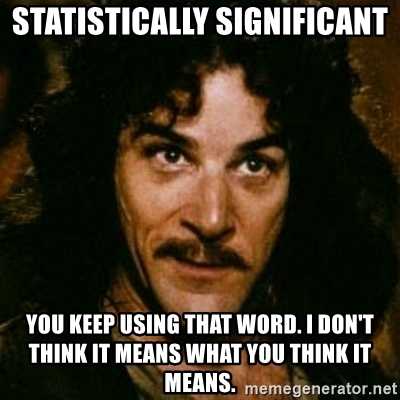

```{r setup, include=FALSE}
library(knitr)
opts_chunk$set(
  echo = TRUE,
  message = FALSE,
  warning = FALSE
)
```

# Video

Watch today's video here:

<iframe width="560" height="315" src="https://www.youtube.com/embed/AgpWX18dby4" frameborder="0" allow="accelerometer; autoplay; clipboard-write; encrypted-media; gyroscope; picture-in-picture" allowfullscreen></iframe>

# Slides

Hover over the slides and press **f** for full screen.
Press **?** for a list of keyboard shortcuts.

```{r}
knitr::include_url("slides2.html")
```

# Script

As you might be able to tell, mental models
are one of my favorite topics.
We are how moving on to another powerful
mental model for a different context.
I am talking about **iteration**.

## Iteration

Iteration is the basic idea of doing one thing multiple times.
This is an area where computers shine,
so in this chapter we will learn to fully utilize
the power at our fingertips.

We had our first encounter with iteration in a very implicit form.
When we use R's basic math operators,
the computer is iterating behind the scenes.
Take this expression:

```{r}
1:3 + 1:3
```

This operation is vectorized.
Without us having to tell R to do so,
R will add the first element of the
first vector to the first element of
the second vector and so forth.

Notice, how it looks like the operation happens all at
the same time.
But in reality, this is not what happens.
The computer is just really fast at adding numbers,
one after the other.

The mathematical operations in R call another
programming language that does the actual addition.
This other programming language is closer to the way computers _think_,
making it less fun to write for us humans,
but also faster because the instructions are faster to translate
into actions by our computer processor.

When we find a task that we want to apply to multiple
things, and this task is not already vectorized,
we need to make our own iteration.
There are actually two schools of though on how to
talk about iteration and consequently, how to write it in code.

I will use a realworld example to illustrate this:

### Reading in Multiple Files with Functional Programming

Remember the `gapminder` dataset?
Well, we are working with it again, but this time,
our collaborator sent us one csv-file for each continent.

We already know how to read in _one_ csv-file:

```{r}
read_csv("data/Africa.csv", n_max = 3) # n_max just for the script
```

We have a function that takes a file path and spits out the data.
So in this first school of thought, the Functional Programming
style, the next idea is to just have a function,
that takes two things: a function and a vector (atomic or list).
And it feeds the individual elements of the vector to the function,
one after another.
In mathematics, the relation between the set of inputs
and the set of outputs of a function is called a **map**,
which is where the name of the following family of functions comes from.
In the tidyverse, these functional programming concepts
live in the `purrr` package.

<aside>
<a href="https://purrr.tidyverse.org/">

```{r purrr-logo, echo=FALSE, out.extra="class=external"}
include_graphics("img/purrr.png")
```

</a>
</aside>

First, we creat the vector of things that we want to iterate over,
the things that will be fed into our function one after the other:

```{r}
paths <- dir("data", full.names = TRUE)
paths
```

Now we have 5 file paths.
We can test our understanding
by passing just one of them to `read_csv` to make sure
our function works:

```{r}
read_csv(paths[[1]], n_max = 3) # again n_max only to not clutter the script
```

It is time for the map function!

```{r}
all_datasets <- map(paths, read_csv)
```

That's it!
We now have a list that contains all five datasets.

```{r}
# I truncated the output of the structure so that it fits
str(all_datasets, give.attr = FALSE, list.len = 3, width = 40)
```

But we lost the information about which file
the elements of the list came from,
which is the name if the continent!
We can fix this by using a named list instead
of a regular list to pass to `map`:

```{r}
names(paths) <- basename(paths) %>%
  str_remove("\\.csv")

my_data <- map(paths, read_csv)

my_data %>% 
  bind_rows(.id = "continent") %>% 
  head() %>% 
  paged_table()
```

There is yet another shortcut we can employ.
The `purrr` package contains various variants of
the `map` function.
`map` itself will always return a list, whereas
variants like `map_chr` always return an atomic
character vector,`map_dbl` always returns numbers,
`map_lgl` always return logical (yes or no, TRUE / FALSE)
vectors.
Combining a list into one dataframe (by rows)
is so common that there is also a special `map` function for this:
`map_dfr`.

```{r}
gapminder <- map_dfr(paths, read_csv, .id = "continent")
gapminder %>% head() %>% paged_table()
```

Now that was efficient, it only took us a couple of lines.
Here is the complete code again, without side-explanations
and in one chain of pipes.

```{r, eval=FALSE}
gapminder <-  dir("data", full.names = TRUE) %>% 
  set_names(function(name) basename(name) %>% str_remove("\\.csv")) %>%
  map_dfr(read_csv, .id = "continent")
```

### The Imperative Programming Approach

There are other ways we could have gone about this.
A common construct in programming language is
the so called **for-loop**.
For every element of a vector,
the body of the loop runs.
For our example, it would look like this:

```{r, eval=FALSE}
paths <- dir("data", full.names = TRUE)
results <- vector("list", length(paths))
for (i in 1:length(paths)) {
  data <- read_csv(paths[i])
  data$continent <- names(paths[1])
  results[[i]] <- data
}
names(results) <- basename(paths) %>% str_remove("\\.csv")
gapminder <- bind_rows(results, .id = "continent")
```

The for-loop-version has a lot more
code, especially _boilerplate_,
code that is just there to make the construct work and
doesn't convey our intentions with the code.
Furthermore, the loop focuses the
object that is iterated over (the file paths),
while the `map`-version focuses on what is
happening (the function, `read_csv`).
But the loop still works.
If you can't think of a way to solve a problem
with a `map` function, it is absolutely
OK to use for-loops.

The first approach with the `map` function
comes from Functional Programming,
whereas the second approach is considered
Imperative Programming.
In general, in Functional Programming, we
**tell the computer what we want**, while
in Imperative Programming,
we **tell the computer what steps to do**.
So keep in mind:

> »Of course someone has to write for-loops.
  It doesn't have to be you."«<br> --- Jenny Bryan

And don't miss the amazing `purrr` cheatsheet:
[link](https://purrr.tidyverse.org/)

### Many Models

https://r4ds.had.co.nz/many-models.html


## What is probability?

Say you and your friends are playing Mario Kart
(or a similar racing game),
when one of your friends proudly proclaims:
"I am the best player among us!"
"Proof it!", you reply.
"That's easy", she says: "I won first place
in 5 out of the

TODO


### Binomial Distribution

The Galton Board

```{r}
library(tidyverse)
```


```{r}
n_layers <- 15
p <- 0.5
n_paths <- 1000

get_random_path <- function(n_layers, p) {
  s <- sample(c(-0.5, 0.5), n_layers, replace = TRUE, prob = c(p, 1 - p))
  c(0, cumsum(s))
}

galton <- tibble(
  trial = 1:n_paths,
  path = map(trial, ~ get_random_path(n_layers, p))
) %>% 
  unnest_longer(path) %>% 
  group_by(trial) %>% 
  mutate(h = n():1)

board <- tibble(
  h = 1:n_layers,
  trial = 1
) %>% 
  mutate(path = map(h, function(h) {
    x <- (n_layers - h)
    (-x/2):(x/2)
  })) %>% 
  unnest_longer(path) %>% 
  mutate(h = h + 0.4)
```


```{r}
library(gganimate)

galton %>% 
  ggplot(aes(path, h, group = trial)) +
  geom_path(alpha = 0.1, size = 2,  lineend = "round") +
  geom_point(data = board) +
  theme_void() +
  # transition_reveal(along = trial) +
  NULL
```


```{r}
galton %>% 
  filter(h == 1) %>% 
  ggplot(aes(path)) +
  geom_histogram(aes(y = stat(count) / sum(count)), binwidth = 0.5)
```


## Visualising Distributions

## Summary Statistics


## Statistically Significant...

> ...you keep using that word.
  I don't think it means what you think it means.

```{r signif, echo=FALSE}

```


# Exercises

# Solutions

# Resources
