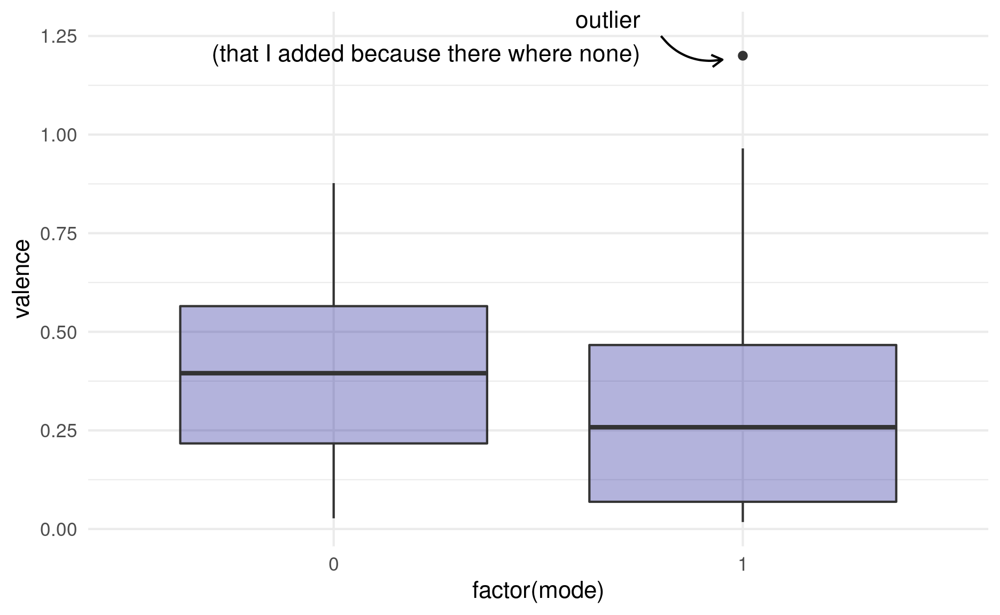
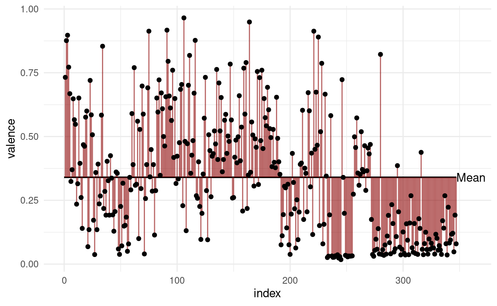
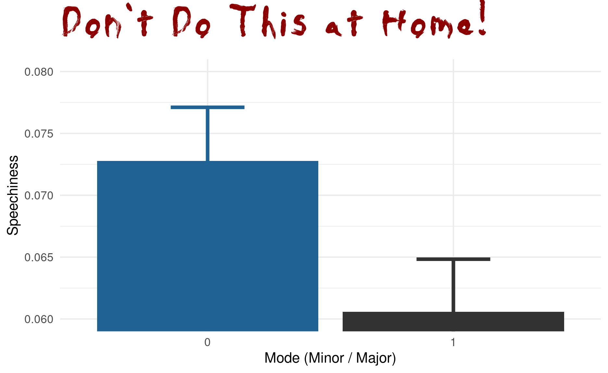
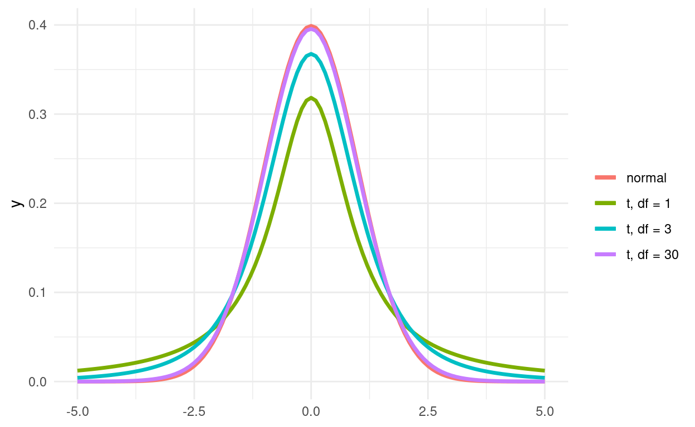

```{r setup, include=FALSE, warning=FALSE}
source(here::here("assets/slide-setup.R"))

xaringanExtra::use_xaringan_extra(c(
  "tile_view", "editable", "animate_css",
  "clipboard", "tachyons"
))
```

layout: true

.absolute.top-0.right-1.tr.w-10[
```{r}
include_graphics("https://raw.githubusercontent.com/jmbuhr/dataIntro20/master/images/hex.png")
```
]

---

name: title
class: left bottom hide-count
background-color: #FBFCFF;

```{r title-slides, echo=FALSE, message = FALSE, warning = FALSE}
htmltools::withTags(
  div(
    class = "talk-meta",
    div(
      class = "talk-title",
      h1(rmarkdown::metadata$title),
      p(rmarkdown::metadata$subtitle)
    ),
    div(
      class = "talk-author",
      paste(rmarkdown::metadata$author, collapse = " <br> "),
      br(),
      span(paste(rmarkdown::metadata$institute, collapse = ", "))
    ),
    div(
      class = "talk-date",
      knitr::knit(text = rmarkdown::metadata$date, quiet = TRUE)
    )
  )
)
```

.absolute.bottom-0.right-1.mid-gray[
With Artwork by @allison_horst
]

---
class: center, middle 

## Reproducible Environments with `renv`

<a href="https://rstudio.github.io/renv/">

</a>

---
class: middle

> »All models are wrong, but some are useful«
> — George Box

---

## Types of Models

1. **Descriptive Models**
2. **Inferential Models** 
3. **Predictive Models** 

```{r echo=FALSE, fig.height=6, fig.width=12}
mpg %>% 
  ggplot(aes(displ, hwy)) +
  geom_smooth() +
  geom_point()
```

---

## Boxplots

```{r}

```

---

## Mean, Variance and SD

$$var(X) = \frac{\sum_{i=0}^{n}{(x_i-\bar x)^2}}{(n-1)}$$

$$\sigma_X=\sqrt{var(X)}$$

```{r}

```

---

## Standard Error of the Mean

$$SEM=\sigma / \sqrt{n}$$

---

```{r}

```

---

So the next time you see a barplot ask the question:

![[@ArtworkAllisonHorst]](img/summary_statistics.png){.external}

---

## The t-distribution

```{r}

```

---
background-image: url(img/whaleshark.png)
background-size: contain


---
background-image: url(img/krill.png)
background-size: contain


